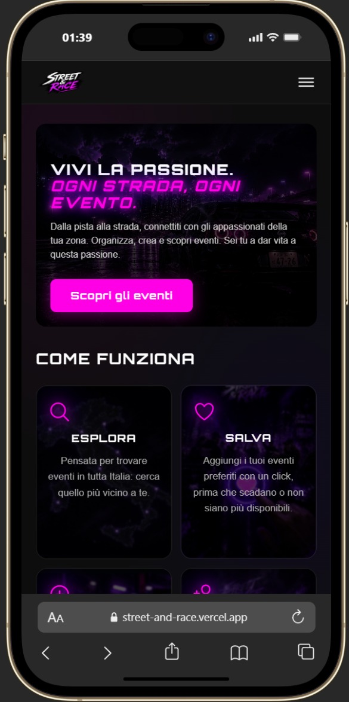

# Street & Race - Piattaforma di Gestione Eventi

## 📋 Panoramica
**Street & Race** è un'applicazione web per la scoperta, creazione e gestione di eventi automobilistici (car meeting, raduni, motorsport). Costruita con tecnologie web moderne, dimostra competenze di sviluppo full-stack includendo autenticazione utente, operazioni CRUD complete su eventi, upload immagini su cloud e funzionalità di preferiti.

**Stato:** Beta Online 🟢

## 🎥 Beta Online & Video

**🌐 Beta live:** [street-and-race.vercel.app](https://street-and-race.vercel.app)

L'app è una **beta funzionante e online**, non solo un prototipo locale: puoi
provarla direttamente dal link sopra.

**Screenshot (desktop):**


**Screenshot (mobile):**



## 🎯 Funzionalità (Attuali)
- ✅ **Autenticazione Utente** - Registrazione, login/logout con token JWT, rate limiting sui tentativi di login
- ✅ **Scoperta Eventi** - Naviga, ricerca e filtra eventi per nome, città e regione
- ✅ **Dettagli Evento** - Visualizza informazioni complete dell'evento con location, indirizzo e orari
- ✅ **CRUD Eventi Completo** - Crea, modifica ed elimina eventi (solo il creatore può modificarli/eliminarli)
- ✅ **Upload Immagini** - Caricamento immagini evento su Cloudinary (max 5MB, solo immagini)
- ✅ **Gestione Preferiti** - Aggiungi/rimuovi eventi preferiti (solo utenti autenticati)
- ✅ **Paginazione** - Lista eventi paginata lato server
- ✅ **Pulizia Automatica** - Cron job notturno che elimina gli eventi scaduti
- ✅ **Interfaccia Responsiva** - Design dark theme mobile-friendly, sidebar desktop + menu hamburger mobile
- ✅ **Integrazione API** - Backend RESTful con validazione (express-validator) e gestione errori appropriata

## 🛠 Stack Tecnologico

### Frontend
- **React 19** - Libreria UI con hooks
- **Vite 6** - Build tool veloce per lo sviluppo
- **React Router 7** - Routing lato client
- **React Bootstrap 2 / Bootstrap 5** - Componenti UI
- **CSS3** - Styling personalizzato (dark theme, design system fucsia/viola)

### Backend
- **Node.js + Express 5** - Framework server
- **MongoDB + Mongoose 8** - Database con ORM
- **JWT (jsonwebtoken)** - Autenticazione/autorizzazione
- **bcrypt** - Hashing delle password
- **Cloudinary + Multer** - Upload e storage immagini eventi
- **express-validator** - Validazione dati lato server
- **node-cron** - Job pianificati (pulizia eventi scaduti)
- **CORS** - Gestione richieste Cross-Origin

## 🚀 Guida Rapida

### Prerequisiti
- Node.js 18+
- Account MongoDB Atlas (o MongoDB locale)
- Account Cloudinary (per l'upload immagini)
- Git

### Installazione & Setup

**1. Clona e naviga al progetto:**
```bash
cd Final-Project
```

**2. Setup Backend:**
```bash
cd "Final Project Back"
npm install
```
Crea file `.env`:
```
MONGODB_URI=your_mongodb_connection_string
JWT_SECRET=your_jwt_secret_key
PORT=3000
```

Avvia il backend:
```bash
npm run dev
```
Il server gira su `http://localhost:3000`

**3. Setup Frontend:**
```bash
cd "Final Project Front/my-Final-Project-app"
npm install
npm run dev
```
L'app gira su `http://localhost:5173`

## 📝 Endpoint API (Backend)

### Utenti
- `POST /api/user/register` - Registra nuovo utente (con validazione)
- `POST /api/user/login` - Login utente (ritorna token JWT + nome utente, rate limited)
- `GET /api/user/profile` - Dati profilo utente loggato (richiede token)
- `GET /api/user/myEvents` - Eventi creati dall'utente loggato (richiede token)
- `GET /api/user/eventsFavourites` - Ottieni eventi preferiti (richiede token)
- `PUT /api/user/eventi/:id/preferiti` - Aggiungi evento ai preferiti (richiede token)
- `DELETE /api/user/eventi/:id/preferiti` - Rimuovi evento dai preferiti (richiede token)

### Eventi
- `GET /api/eventi` - Ottieni tutti gli eventi (paginata)
- `GET /api/eventi/:id` - Ottieni dettagli evento
- `POST /api/eventi/` - Crea nuovo evento (richiede token, upload immagine su Cloudinary)
- `PUT /api/eventi/:id` - Modifica evento (solo il creatore)
- `DELETE /api/eventi/:id` - Elimina evento (solo il creatore)

## 🔑 Dettagli Implementazione

### Flusso Autenticazione
Gli utenti si autenticano tramite token JWT memorizzati in `localStorage`. Il token è inviato nell'header `Authorization` per le rotte protette:
```
Authorization: Bearer <jwt_token>
```

### State Management
State a livello componente con React hooks (`useState`, `useEffect`) per semplicità. Nessuna libreria esterna per lo stato.

### Schema Database
- **Users** - nome, email, password (hashata), data nascita, array eventi preferiti
- **Events** - nome, location, via, data, orario, descrizione, descrizione dettagliata, organizzatore, immagine (URL Cloudinary), regione/provincia geografica, creatore

## 📚 Problemi Noti & Miglioramenti Futuri

### Limitazioni Attuali
- Nessuna verifica email durante la registrazione
- Validazione dei form lato client (frontend) ancora limitata

### Funzionalità Pianificate
- [ ] Validazione form frontend (lato client, prima dell'invio)
- [ ] Google Auth (opzionale, da valutare)

## 🧪 Testing
Attualmente nessun test automatizzato. Testing manuale consigliato:
1. Registra nuovo utente
2. Login con credenziali
3. Naviga, filtra e ricerca eventi
4. Aggiungi/rimuovi dai preferiti
5. Crea, modifica ed elimina un evento

## 📦 Struttura Progetto
```
Final-Project/
├── Final Project Back/       # API Node.js + Express
│   ├── config/                # Configurazione Cloudinary
│   ├── controllers/           # Gestori rotte (eventi, utenti)
│   ├── jobs/                  # Cron job pulizia eventi scaduti
│   ├── models/                # Schema MongoDB
│   ├── routes/                # Endpoint API
│   ├── validators/            # Validazione dati (express-validator)
│   ├── index.js                # Entry point server
│   └── package.json
├── Final Project Front/      # Frontend React + Vite
│   └── my-Final-Project-app/
│       ├── src/
│       │   ├── components/    # Componenti React riutilizzabili (card eventi, navbar, preferiti, banner...)
│       │   ├── data/          # Mappa città per regione italiana
│       │   ├── router-dom-page/   # Componenti pagina per routing
│       │   ├── style/         # File CSS
│       │   └── App.jsx        # Componente principale app
│       └── package.json
└── README.md
```

## 👤 Autore
**Danny** - Full Stack Developer

## 📄 Licenza
ISC

## 💡 Focus
Questo progetto dimostra:
- Sviluppo Full-Stack JavaScript/Node.js
- Design pattern API RESTful
- Implementazione di autenticazione e autorizzazione
- Upload e gestione immagini su cloud storage
- Architettura componenti React e hooks
- Design database e query
- Workflow Git e version control

Come prototipo funzionante, l'attenzione è stata sulla funzionalità e l'apprendimento di concetti core. Il codebase è pulito e mantenibile con spazio per scalabilità e nuove feature.
